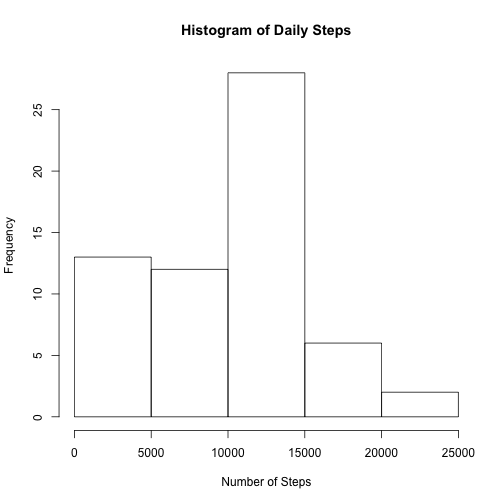
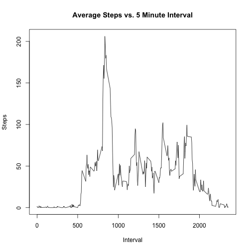
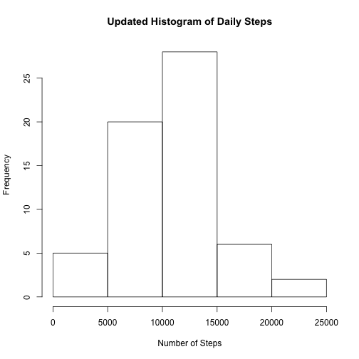
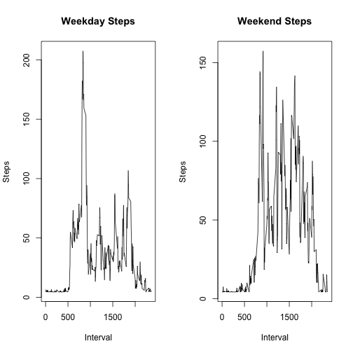

I received data from the Coursera website on steps taken as measured by a tracking device. The original data was a zip file.  I am using a Mac, so I needed to unzip the file.  I ran the following from the command line:

"unzip repdata-data-activity-zip""

and the appropriate CSV file was produced.

Once in R, I did the following:


```r
#Obtain the data, put the date into character string
fitbit.df <- read.csv(file="activity.csv",header=TRUE,stringsAsFactors = FALSE)
fitbit.df$DT <- as.Date(fitbit.df$date,"%Y-%m-%d")
#Verify success for data input
str(fitbit.df)
```

```
## 'data.frame':	17568 obs. of  4 variables:
##  $ steps   : int  NA NA NA NA NA NA NA NA NA NA ...
##  $ date    : chr  "2012-10-01" "2012-10-01" "2012-10-01" "2012-10-01" ...
##  $ interval: int  0 5 10 15 20 25 30 35 40 45 ...
##  $ DT      : Date, format: "2012-10-01" "2012-10-01" ...
```

Now I want to obtain the number of steps for each day.  At the moment, I will disregard the NA values, but will return to those later.  Here is the code, followed by a histogram.


```r
step1 <- by(fitbit.df$steps,as.factor(fitbit.df$DT),sum,na.rm=TRUE)
hist(step1,xlab="Number of Steps",main="Histogram of Daily Steps")
```

 

My next task is to calculate the mean and median.  But the ``na.rm`` argument must be set to TRUE because of the missing values.


```r
mean(step1,na.rm=TRUE)
```

```
## [1] 9354.23
```

```r
median(step1,na.rm=TRUE)
```

```
## [1] 10395
```

Not surprisingly, the mean and median are very close.  This is consistent with the symmetry seen in the histogram.

Now I will consider the time interval within each day.  I will produce a time series such that the time unit is the interval itself and the $y$ variable is the number of steps.


```r
step2 <- by(fitbit.df$steps,as.factor(fitbit.df$interval),mean,na.rm=TRUE)
int.unq <- unique(fitbit.df$interval)
plot(int.unq,step2,type="l",xlab="Interval",ylab="Steps")
title("Average Steps vs. 5 Minute Interval")
```

 

```r
#Find the Maximum Steps in a 5 Min Interval
max(step2)
```

```
## [1] 206.1698
```

```r
#Which Interval?
int.unq[which.max(step2)]
```

```
## [1] 835
```

Of course, there is minimal activity immediately after midnight and late in the evening.  The maximum here is shown to be 10927, and that occurs at 835.


There are, as mentioned, quite a few rows with NA values.  It is easy to see how many:


```r
sum(!complete.cases(fitbit.df))
```

```
## [1] 2304
```

There are 2304 rows with missing data.  Therefore, it would be worthwhile to make some adjustments to the data set.


I am going to use the median number of steps per time interval to fill in the NA for the steps.


```r
newfit.df <- fitbit.df
xs <- is.na(newfit.df$steps)
newfit.df$steps[xs] <- median(step2)
step1a <- by(newfit.df$steps,as.factor(newfit.df$DT),sum,na.rm=TRUE)
hist(step1a,xlab="Number of Steps",main="Updated Histogram of Daily Steps")
```

 

```r
mean(step1a)
```

```
## [1] 10642.7
```

```r
median(step1a)
```

```
## 2012-10-20 
##      10395
```

By applying the median, both the mean and median have increased. But elimination of NA values can allow us to run all models.  Very often, the presence of NA values excludes certain formulae from being processed.


Finally, I will consider a multivariate time series, such that the day of the week is taken into account.


```r
newfit.df$wd1 <- weekdays(newfit.df$DT)
newfit.df$WORK <- ifelse(newfit.df$wd1=="Saturday" | newfit.df$wd1=="Sunday","weekend","weekday")
newfit.df$WORK <- factor(newfit.df$WORK)
step4 <- by(newfit.df$steps,list(as.factor(newfit.df$interval),newfit.df$WORK),mean)
par(mfrow=c(1,2))
plot(int.unq,step4[,1],type="l",xlab="Interval",ylab="Steps",main="Weekday Steps")
plot(int.unq,step4[,2],type="l",xlab="Interval",ylab="Steps",main="Weekend Steps")
```

 

All days begin with the same basic pattern.  But the weekend days maintain the high level more consistently throughout the day.  Thus, the weekend warriors are very busy, as evidenced by this particular data set.
